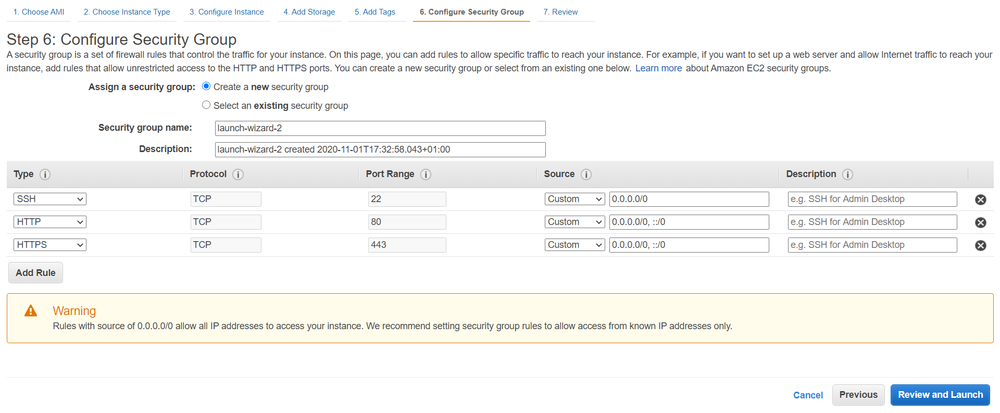
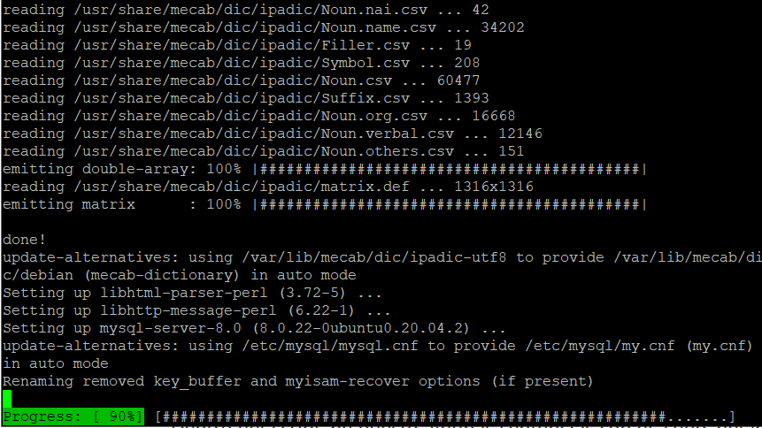
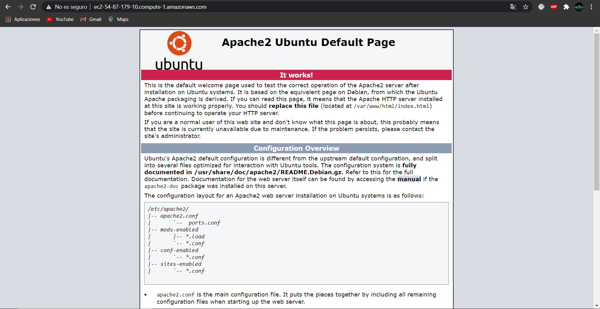

# Práctica 2 IAW
En esta práctica explicaré como implantar una aplicación web LAMP en una instancia de Amazon Web Services (AWS).  
Lo primero que haremos será crear una máquina virtual en Amazon EC2. Para ello entraremos en la página de [AWS](https://www.awseducate.com), entraremos en la clase donde queramos crear la máquina y crearemos una instancia nueva. Cogeremos un Ubuntu Server 20.4. Luego seguiremos configurando la máquina con todo lo que viene por defecto hasta que llegemos al paso 6 Configure Security Group, donde seleccionaremos que puertos queremos que estén abiertos. En nuestro caso pondremos los puertos de SSH, HTTP y HTTPS (22, 80 y 443 respectivamente).   
Ya solo faltaría lanzarla y conectarnos a ella.  
Para conectarnos necesitamos una clave que nos proporciona Amazon, con la que nos conectamos a través de SSH.  
Lo que haremos será conectarnos a la instancia a través de Visual Studio, donde seguiremos unos [pasos que nos indicarán como hacerlo.](https://dev.to/dre4success/ssh-to-an-ec2-instance-from-vs-code-2707)  
Cuando hayamos lanzado la instancia solo tendremos que ejecutar el script de instalacion de la pila LAMP.   

Para comprobar que funciona, tendremos que poner la IP publica de la instancia en el navegador web. 

Con todo esto ya tendríamos configurado la instancia con una pila LAMP funcionando.

### Juan José Berbel Najas 2ºASIR